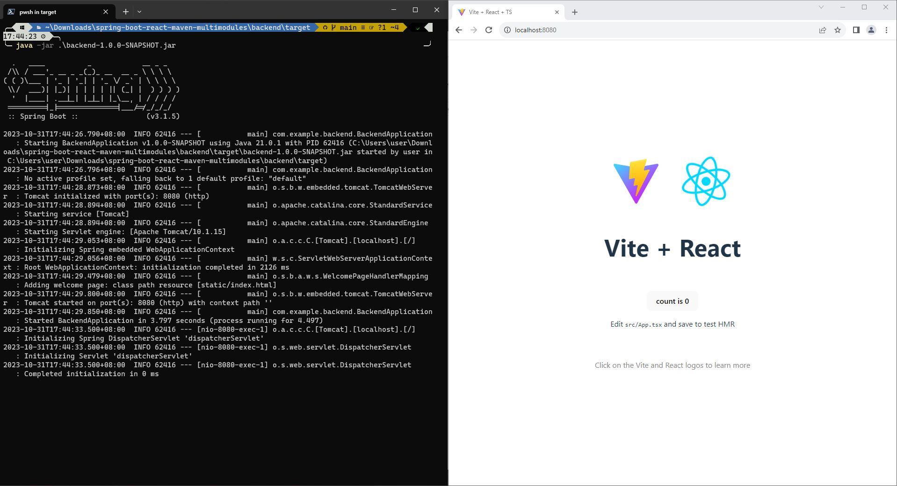

# Spring Boot & React, Maven Multi-Modules Example

My solution to the question I posted on [Reddit](https://old.reddit.com/r/learnjava/comments/17kbto4/maven_multimodules_and_reactspring_boot/).

## Instruction

### First steps

1. Create an empty top-level pom:

   - `mvn archetype:generate "-DarchetypeGroupId=org.codehaus.mojo.archetypes" "-DarchetypeArtifactId=pom-root" "-DarchetypeVersion=RELEASE"`

2. Create an child maven module (for the React project):

   - `mvn archetype:generate "-DarchetypeGroupId=org.apache.maven.archetypes" "-DarchetypeArtifactId=maven-archetype-quickstart" "-DarchetypeVersion=RELEASE"`

3. Copy the content of `pom.xml` in the newly generated folder and paste it to a temp notepad, then delete the folder

4. Create a new React project (I used Vite with NPM):

   - `npm create vite@latest`

5. Create a `pom.xml` inside the newly generated folder and paste the content you copied in step 3 into it.
6. Replace the whole `<properties>` section with the following:

```xml
<properties>
  <!-- Change as appropiate -->
  <node.version>v20.9.0</node.version>
  <frontend-maven-plugin.version>1.14.2</frontend-maven-plugin.version>
  <frontend.build.output.dir>${basedir}/dist</frontend.build.output.dir>
  <maven-resources-plugin.version>3.3.1</maven-resources-plugin.version>
</properties>
```

7. Create a Spring Boot project with [Spring Initializr](https://start.spring.io/) with the dependencies you need. You should at least add `Spring Web`
8. Download and unzip the Spring Boot project onto the top-level folder
9. Add `<module>backend</module>` item into the `<modules>` section in the top-level `pom.xml` (Replace `backend` with the folder name of your Spring Boot folder)
10. Move the maven related item in the `backend` folder to top-level:

- `mv mvnw* ..`

- `mv .mvn ..`

Now your folder structure should be something like this:

```
root
|
|- backend
|   |- pom.xml
|   |- src
|       |- Java source files...
|   |_ Other files...
|
|- frontend
|   |- pom.xml
|   |- src
|       |- React source files...
|   |_ Other folder and files...
|
|- pom.xml
|
|_ Other Maven related items...
```

### Preparing build

1. Open the `pom.xml` in the `frontend` folder with an editor.

Replace the whole `<pluginManagement>` section with the following:

```xml
<plugins>
  <plugin>
    <groupId>com.github.eirslett</groupId>
    <artifactId>frontend-maven-plugin</artifactId>
    <version>${frontend-maven-plugin.version}</version>

    <configuration>
      <installDirectory>target</installDirectory>
    </configuration>

    <executions>
      <execution>
        <id>install node and npm</id>
        <phase>generate-resources</phase>
        <goals>
          <goal>install-node-and-npm</goal>
        </goals>
        <configuration>
          <nodeVersion>${node.version}</nodeVersion>
        </configuration>
      </execution>
      <execution>
        <id>npm install</id>
        <phase>generate-resources</phase>
        <goals>
          <goal>npm</goal>
        </goals>
        <configuration>
          <arguments>install</arguments>
        </configuration>
      </execution>
      <execution>
        <id>npm run build</id>
        <phase>generate-resources</phase>
        <goals>
          <goal>npm</goal>
        </goals>
        <configuration>
          <arguments>run build</arguments>
        </configuration>
      </execution>
    </executions>
  </plugin>
  <plugin>
    <artifactId>maven-resources-plugin</artifactId>
    <version>${maven-resources-plugin.version}</version>
    <executions>
      <execution>
        <id>copy react build files</id>
        <goals>
          <goal>copy-resources</goal>
        </goals>
        <phase>prepare-package</phase>
        <configuration>
          <outputDirectory>${project.build.outputDirectory}/static</outputDirectory>
          <resources>
            <resource>
              <directory>${frontend.build.output.dir}</directory>
            </resource>
          </resources>
        </configuration>
      </execution>
    </executions>
  </plugin>
</plugins>
```

1. Add the `frontend` module as dependency into the `backend` module (add to `backend/pom.xml`):

```xml
<!-- Change as appropiate -->
<dependency>
  <groupId>com.example</groupId>
  <artifactId>frontend</artifactId>
  <version>1.0.0-SNAPSHOT</version>
</dependency>
```

3. Run `mvn clean verify` in the top-level folder. Then find the Spring Boot JAR in `backend/target`

4. Run the JAR: `java -jar <jar-filename>`. Go to `localhost:8080` and you should see the React page!



## Reference

[Stack Overflow: How to integrate a React webapp inside a spring boot Application with jar packaging](https://stackoverflow.com/a/64060302)

[Spring: Creating a Multi Module Project](https://spring.io/guides/gs/multi-module/)
